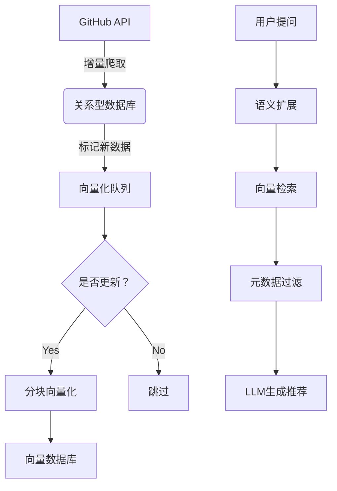

## helloReadme
helloReadme 是一个基于RAG（检索增强生成）的GitHub项目智能推荐系统，能够自动采集AI相关项目信息，并为用户提供个性化推荐。系统集成了Web界面和命令行工具，支持多种采集方式和智能数据管理。

此项目代码全部由ai实现，本人不会python；有10年后端开发经验；需要熟悉开发，能看懂基本代码，代码量多的时候还是需要人工介入审核告诉ai



技术选型：
开发语言：Python 3.12+
数据库：SQLite (起步) + SQLAlchemy (抽象层)
向量库：ChromaDB
github api:PyGitHub (GitHub 官方 SDK) + requests
向量化模型：sentence-transformers (Hugging Face) + SQLAlchemy (ORM)
web管理系统：Flask 
数据迁移：Alembic + SQLAlchemy
向量模型管理：Hugging Face Hub + Config 文件
部署形式：docker管理
用户层使用：支持小程序，web页面等


核心模块：
1. github api采集项目信息
2. 向量化数据
3. ai+rag问答检索

周边功能web管理系统：
1. 管理数据库：可以替换数据库存储方式，如果替换了新的数据库可以自动将原来数据库的数据迁移到新的数据库
2. 向量模型管理：可以更换新的向量模型
3. ai管理：可以更换不同的ai的api或模型
4. 项目管理：可以增删改查采集的github项目


开发步骤：
1. 构建整体框架，分好模块
2. 核心功能实现
3. 周边开发

------------
下面的内容是2025.8.15写的，编辑器用的是cursor auto，还用qwen，grok等ai辅助。因为发展太快下面内容只能当下有用，未来会因ai的增强而改变。

准备工作：
1. 项目架构和技术选型 确认好和ai询问优缺点 完善流程和技术点，前期能确定的都确定好，减少ai不确定性
2. 创建文件夹分好功能模块，指挥ai在哪里实现防止他乱写：ai经常写一些脚本或测试写的到处都是；代码设计的重点之一就是解耦乱写容易影响后续维护和扩展
3. 开始开发之前，可以让所有功能都以事件形式触发，无论是test/web按钮/cli 等：（比如本来要自动定时或按一些策略采集数据，但改为页面操作）：这样的目的是可以快速确认功能是否符合要求，便于让ai调整
4. 一定要把源头的数据结构先规范好，比如此项目的源头数据是github项目信息，信息的字段类型结构都要明确好，否则ai可能会再实现不同模块的情况下乱用，减少他的乱用
5. 一个对话只做一件事，善于用git，每次完成一次工作就保存一下，出问题后及时git checkout .
4. 先实现第一个核心功能的逻辑（比如github api采集后写入数据库）+web页面能看到数据（确保实现符合要求）
5. 一步步实现全部核心功能，每次完成一个就开启新会话，保持上一个功能完善+文字说明（下一个会话能迅速理解）
6. 当点击页面发现功能符合要求后再让ai转为自动形式 这样转换对于ai来讲易如反掌
5. 开始实现周边功能，依旧是分好模块，分割到最小粒度
6. 完成整体；优化文档

## ✨ 核心功能

### 🔍 GitHub项目采集
- **搜索采集**: 根据关键词搜索并采集相关项目
- **用户采集**: 采集指定用户的所有项目
- **组织采集**: 采集指定组织的所有项目
- **增量更新**: 智能识别新项目和更新现有项目
- **批量操作**: 高效的批量保存和更新

### 🌐 Web管理界面
- **数据采集**: 直观的Web表单进行项目采集
- **项目浏览**: 分页显示所有采集的项目
- **数据筛选**: 支持按语言、星标数等条件筛选
- **统计信息**: 实时显示采集统计和语言分布
- **响应式设计**: 基于Bootstrap 5的现代化UI

### 💾 数据存储
- **抽象化设计**: 支持多种数据库后端（当前使用SQLite）
- **向量化存储**: 使用ChromaDB存储项目向量
- **语义检索**: 基于sentence-transformers的语义搜索
- **数据迁移**: 支持数据库备份、恢复和迁移

### 🤖 智能推荐
- **AI生成**: 结合LLM的智能推荐生成
- **语义匹配**: 基于项目描述的智能匹配
- **个性化推荐**: 根据用户偏好提供定制化建议

## 🛠️ 技术架构

- **后端框架**: Flask 3.0+
- **数据库**: SQLite + SQLAlchemy + Flask-Migrate
- **向量数据库**: ChromaDB
- **前端**: Bootstrap 5 + jQuery + 原生JavaScript
- **GitHub API**: PyGithub
- **异步处理**: asyncio
- **日志系统**: loguru
- **向量化**: sentence-transformers

## 🚀 快速开始

### 启动Web应用（推荐）

```bash
# 启动Flask Web服务
python main.py
```

启动后访问：http://localhost:5000

## 📁 项目结构

```
helloReadme/
├── README.md                 # 项目说明文档
├── requirements.txt          # Python依赖包
├── .env                      # 环境配置文件
├── main.py                   # 主启动入口（唯一启动文件）
├── src/                      # 核心源代码
│   ├── __init__.py
│   ├── cli.py               # 命令行工具
│   ├── main.py              # 主程序
│   ├── config/              # 配置模块
│   │   ├── __init__.py
│   │   └── settings.py      # 应用配置
│   ├── models/              # 数据模型
│   │   ├── __init__.py
│   │   └── base.py          # 基础数据模型
│   ├── services/            # 业务服务层
│   │   ├── __init__.py
│   │   ├── database/        # 数据库服务
│   │   │   ├── __init__.py
│   │   │   ├── base.py      # 数据库接口
│   │   │   └── sqlite.py    # SQLite实现
│   │   └── github/          # GitHub服务
│   │       ├── __init__.py
│   │       └── collector.py # GitHub采集器
│   ├── utils/               # 工具模块
│   │   ├── __init__.py
│   │   └── logger.py        # 统一日志配置
│   ├── web/                 # Web前端相关
│   │   ├── __init__.py
│   │   ├── app.py           # Flask应用主文件
│   │   ├── routes/          # 路由模块
│   │   ├── templates/       # HTML模板
│   │   └── static/          # 静态资源
├── tests/                    # 测试代码
├── logs/                     # 日志文件（自动生成）
├── vector_db/                # 向量数据库存储
├── instance/                 # 实例配置（Flask自动生成）
└── .vscode/                  # VSCode配置
```

## 🔧 配置说明

### GitHub API配置
```bash
# GitHub API Token（推荐）
GITHUB_TOKEN=your_github_token_here

# 搜索查询词
GITHUB_SEARCH_QUERY=AI machine learning artificial intelligence

# 最大采集数量
GITHUB_MAX_REPOS=1000

# 请求间隔（秒）
GITHUB_RATE_LIMIT_DELAY=1.0
```

### 数据库配置
```bash
# 数据库连接字符串
DATABASE_URL=sqlite:///./hello_readme.db

# 是否显示SQL语句
DATABASE_ECHO=false
```

### Flask配置
```bash
# 应用密钥
SECRET_KEY=your_secret_key_here

# 调试模式
DEBUG=true
```

## 🔮 扩展开发

### 添加新的数据源
1. 继承 `DataSourceCollector` 基类
2. 实现 `collect` 方法
3. 在配置中添加相关设置

### 更换数据库
1. 实现 `DatabaseInterface` 接口
2. 在配置中指定新的数据库URL
3. 系统会自动使用新的数据库实现

### 添加新的Web页面
1. 在 `app.py` 中添加路由
2. 创建对应的模板文件
3. 添加必要的JavaScript功能

### 更换向量模型
1. 在配置中修改 `VECTOR_MODEL_NAME`
2. 系统会自动下载和使用新的模型

## 📝 更新日志

### v0.1.0 (2024-01-XX)
- 初始版本发布
- 支持GitHub项目采集
- 提供Flask Web界面
- 支持SQLite数据存储
- 集成向量数据库和语义搜索
- 提供完整的命令行工具